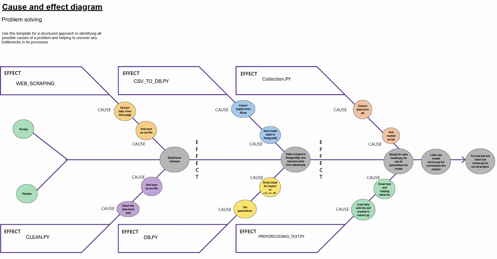
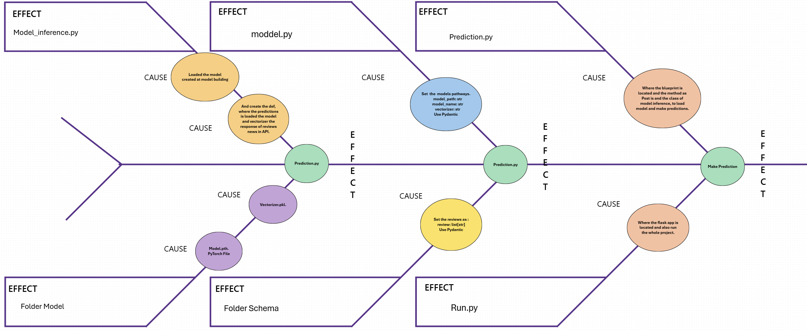
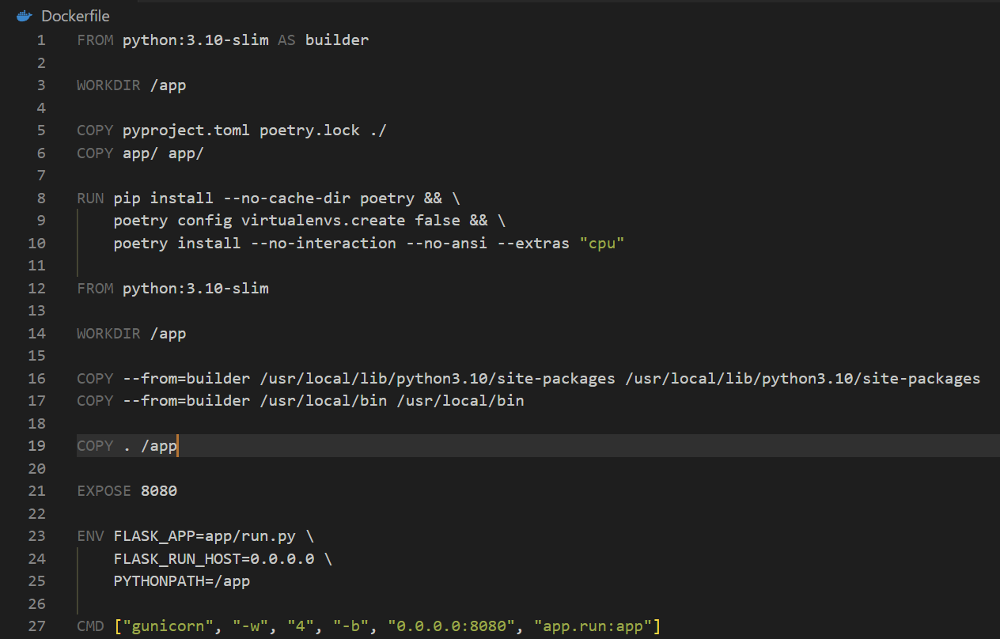
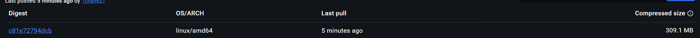
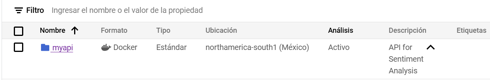
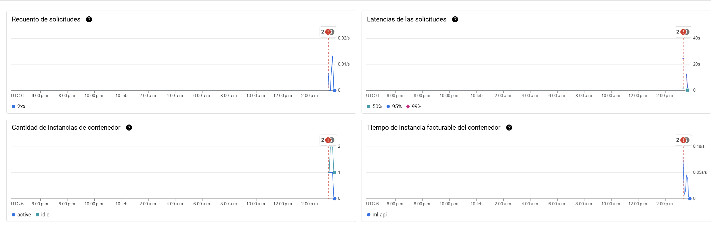
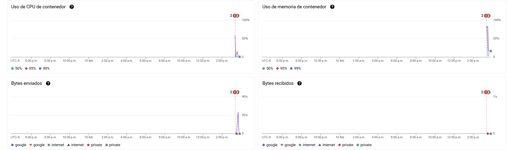
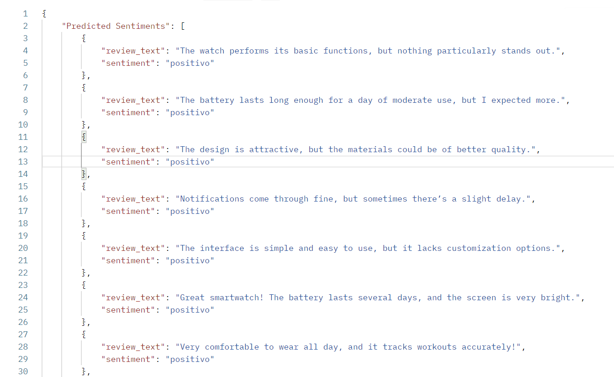

# Comprehensive Sentiment Analysis Project: Merging Data Science and MLOps.

## Summary
This project exemplifies the perfect synergy between Data Science and MLOps, offering one integral and scalable solution for sentiment analysis in reviews (Positive, Neutral & Negative). Designed to production environments, integrated a workflow end-to-end, encompassing data acquisition and processing data up to automation deployment to Cloud services.

## Motivation and goals
- **Motivation:**  
  Taking importance to the necessity of one tool which interpret texts sentiments automatically, adding facilities at the time to take decisions in areas, such as customer service, social media reviews analysis, etc.
- **Targets:**  
  - Robust development of the sentiment analysis model
  - API integration that allows consuming the model in real time.
  - MLOps good practices for guaranteed scalability and maintainability.

---

## Pipeline Model Building 

- **Web Scraping:**  
  Collect data Automatically from different sources, ensuring the diversity and relevance of the dataset.

- **ETL:**  
  Implementing extract, transform and load, clean data structure process, ensuring the quality and necessary consistency to obtain robust training.

- **Development and model training:**  
  Design and optimize ML algorithms to classify sentiments with rigorous validation to achieve top precision levels.

---

## Pipeline Model Inference

- **API:**  
  API RESTful Development for expose ML model, allowing his simple integration with apps or external services.

- **Docker container:**  
  Construction of Docker images to encapsulate the app, ensuring portability and a consistent execution environment.

- **Deploy on Google Cloud Run:**  
  Cloud Environment implementation managing automation scalability and top disposition to adapting to real time demands.

- **CI/CD GitHub Actions:**  
  Pipelines continuous Integration and continuous deployments for tests, updates and deploys automation, reducing errors and performing iterations

---

## Strategic Value

This project optimizes lifecycle deployment and implementation, offering an innovative solution what stand out with the current standards of scalability, reliability and efficiency.
His modular and automatic approach converts into attractive solutions to organizations what are looking for implementing artificial intelligence solutions in production environments with high operational demands.

---

## Context
In this workflow, the model building team trains and adjusts specialized ML model for sentiment analysis. Once trained, the model is given to the model inference team to integrate at production environment through API. Providing scalable, efficient and user-friendly solutions to use for predictions.

## Main Operations Model Building 
This project is structured in 5 stages:

### 1. **Web Scraping**
   - **Description**: extract reviews and metadata of products from websites automatically.
   - **Tools**:
     - `Scrapy`  for HTML parsing and Data extraction at a larger scale.

---

### 2. **Data Cleaning and Processing**
   - **Description**: Transformation of raw data into structured and clean data.
   - **Key Tasks**:
     - Elimination of duplicates.
     - Text normalization (lowercase, special character deletion).
     - Treatment of missing values.
   - **Tools**: `Pandas`, `re` (regular expressions).

---

### 3. **ETL (Extract, Transform and Load)**
   - **Description**: Implementation of an ETL pipeline to load the clean data into a database.
   - **Process**:
     - **Extraction**: Clean data from CSV file, Book1.
     - **Transformation**: Optimize data for efficient storage.
     - **Carga**: Insert data into PostgreSQL using  `SQLAlchemy`.
   - **Tools**:
     - `Pandas` y `SQLAlchemy` for ETL operations.
     - PostgreSQL for data storage.

---

### 4. **Storage in PostgreSQL**
   - **Description**: Structured and efficient data storage.
   - **Structure of the database**:
     - **Main table**: `review_analysis_`
        | Column  | Type         | Description                        |
        |---------|-------------|-------------------------------------|
        | id      | SERIAL (PK) | Unique identifier of the review     |
        | author  | VARCHAR     | Name of the reviewer                |
        | date    | VARCHAR     | Review date                         |
        | header  | VARCHAR     | Review preview                      |
        | rating  | INTEGER     | Sentiment (positive, negative...)   |
        | review  | TEXT        | Product review                      |
   - **Secure Connection**: Use of credentials stored in environment variables.
   - **Tool:**: PostgreSQL with `SQLAlchemy` ORM.

---

### 5. **Sentiment Analysis**
   - **Description**: Identification of the sentiment associated with each review.
   - **Method used**:
     - Sentiment Analysis Based on Supervised Neural Networks. By training in tagged data.
   - **Tags of Feeling**:
     - Positive
     - Negative
     - Neutral
   - **Tools**: `PyTorch`, `NLTK`, `Scikit-Learn`.

### Architecture Diagram Model Building 
  
_Description:_  
The diagram shows how web scraping data is received, processed using NN techniques, sentiment analyzed, and a response returned.

### Problem Solved
The project approaches the need to collect unstructured information from the web, properly process it, store it efficiently and analyze the sentiment associated with user’s opinions about specific products. This allows identifying key patterns, such as product perception or market trends. 
Using Neural Networks, instead of transformers, to avoid the use of GPUS in the cloud and future costs. But if it’s the case to be able to handle this type of processing would be even better, the prediction of sentiment with Fine-Tuning.

## Project structure Model Building
```
|-- .github/
|    |-- action.yml              # GitHub Actions CI/CD.
|
|-- src/
|   |-- runner.py                # Orchestrate the whole project.
|   |
|   |-- config/
|   |   |-- __init__.py          # Init config.
|   |   |-- .env                 # Enviroments varaibles.
|   |   |-- csv_to.py            # Extract data cleaned load into Database.
|   |   |-- csv.py               # Pydantic Functions.
|   |   |-- db.py                # Pydantic Functions.
|   |   |-- logger.py            # Pydantic Functions.
|   |   |-- model.py             # Pydantic Functions.
|   |  
|   |-- db/
|   |   |-- db_model.py          # Characteristics of database.
|   |
|   |-- model/
|   |   |-- models/
|   |   
|   |   |-- pipeline/
|   |   |-- Book1.csv                   # Web scraping Data.
|   |   |-- clean.py                    # Data cleanup with Pandas and Regex.
|   |   |-- collection.py               # Collect data from database.
|   |   |-- model_2.py                  # Using torch.jit way.
|   |   |-- model.py                    # Using torch.save.
|   |   |-- preproccessing_text.py      # Apply NLTK techniques to data from database.
|   |   |-- model_service.py            # This module provides functionality for managing a ML model.
|   |
|   |-- logs/
|   |   |-- app.logs                    # Logs File.
|
|-- Makefile                # Archive for automation.
|-- poetry.lock             # Lockfile Poetry.
|-- pyproject.toml          # Project dependencies
|-- README.md               # Project documentation.
|-- setup.cfg               # Additional Python configuration.
|
```

#### Architecture Diagram Model Inference
  

## Project structure Model Inference
```
|-- .github/
|   |-- ci/cd.yml            # GitHub Actions CI/CD
|
|-- app/
|   |-- run.py               # API Code(Flask).
|   |
|   |-- api/
|   |   |-- prediction.py    # Blueprint Code.
|   |  
|   |-- config/
|   |   |-- __init__.py      # Init Config.
|   |   |-- .env             # Enviroments varaibles.
|   |   |-- model.py         # Model Configuration.
|   |
|   |-- model/
|   |   |-- Sentiment_model_complete.pth  # Trained Model.
|   |   |-- vectorizer.pkl                # Text vectorizer.
|   |                 # You need to create these files on your own.
|   |-- schema/
|   |   |-- review_analysis.py   # Pydantic Schema.
|   |
|   |-- services/
|   |   |-- __init__.py
|   |   |-- model_inference.py   # Model inference
|
|-- Dockerfile              # File to contain the application.
|-- Makefile                # Archive for automation.
|-- poetry.lock             # Lockfile Poetry.
|-- pyproject.toml          # Project dependencies.
|-- README.md               # Project documentation.
|-- setup.cfg               # Additional Python configuration.
```
- **app/**: Contains the main API code.
- **Dockerfile**: File to contain the application.
- **pyproject.toml**: Project dependencies.
- **README.md**: Project documentation.

## Design considerations
This project is designed as a functional prototype to demonstrate technical skills in a controlled environment. Currently, the API is synchronous, which is suitable for a single user who makes requests for sentiment analysis.

In a production environment with multiple users or high volumes of requests, it is recommended to implement an asynchronous architecture.


## Docker
  
After the model inference team has created the API, it is used to create the docker image. Giving way to using multistage builds to reduce image weight, I avoid high runtime times on CI/CD with GITHUB Actions.

## Docker Image

   


## Google Clodu Run
   
Giving use to the created docker image, making deploy of this in google cloud.

- **Monitoring Dashboard:**  
    
    
  _Description:_ Real-time view of requests and responses processed by the API through Google Cloud Run.

- **API Response Example:**  
    
  _Description:_ Example of the returned JSON showing the sentiment ranking and corresponding score.

## Conclusion and Future Improvements
- **Conclusion:**  
  In summary this project represents a significant advancement integration of Data Science and MLOps, providing end-to-end Sentiment Analysis Reviews solution. The implemented architecture guarantees efficient and scalable workflow, encompassing data acquisition and processing to automated cloud deployment.  The use of automated pipelines for model building and inference, combined with a robust CI/CD strategy, underscores our commitment to quality, agility, and innovation. This approach not only solves today's problems but also gets us ready for future improvements and adaptations in high-demand environments, positioning the project as a benchmark in the field of industrial artificial intelligence.
- **Future Improvements:**  
  Expand the project, for example, by enhancing model accuracy, adding support for multiple languages, or integrating new data sources.